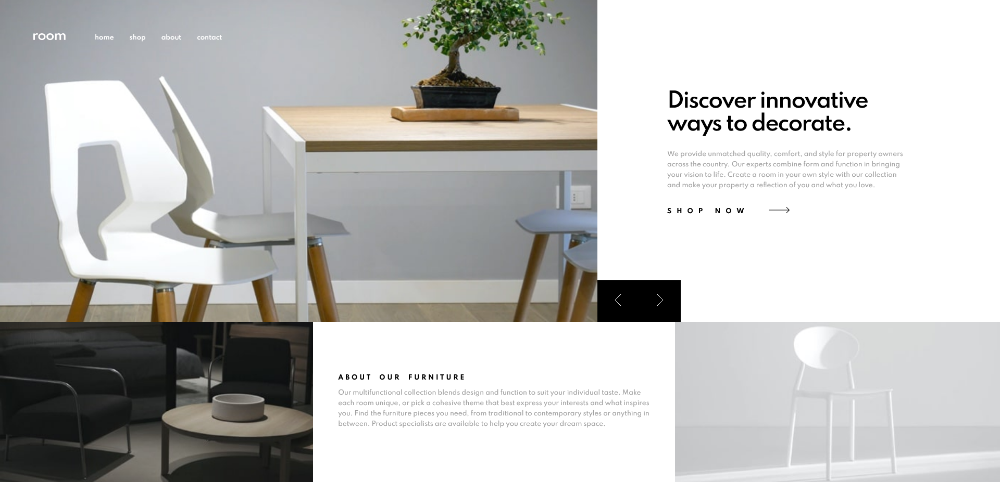

# Frontend Mentor - Room homepage solution

This is a solution to the [Room homepage challenge on Frontend Mentor](https://www.frontendmentor.io/challenges/room-homepage-BtdBY_ENq). Frontend Mentor challenges help you improve your coding skills by building realistic projects. 

## Table of contents

- [Overview](#overview)
  - [The challenge](#the-challenge)
  - [Screenshot](#screenshot)
  - [Links](#links)
- [My process](#my-process)
  - [Built with](#built-with)
- [Author](#author)

## Overview

### The challenge

Users should be able to:

- View the optimal layout for the site depending on their device's screen size
- See hover states for all interactive elements on the page
- Navigate the slider using either their mouse/trackpad or keyboard

### Screenshot

### Links

- Live Site URL: [https://i-5iici.github.io/Room-Homepage/](https://i-5iici.github.io/Room-Homepage/)

## My process

### Built with

- HTML5 markup
- CSS Transitions
- Mobile-first workflow
- JS (GSAP)

## Author

- Instagram - [5iici](https://www.instagram.com/5iici)
- Frontend Mentor - [@i-5iici](https://www.frontendmentor.io/profile/i-5iici)
- Twitter - [@5_iici](https://www.twitter.com/5_iici)